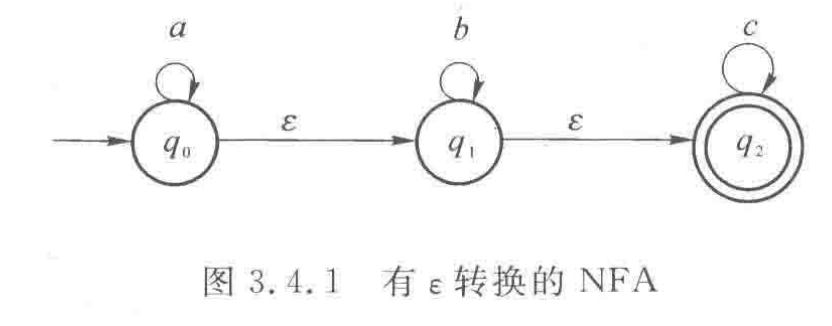
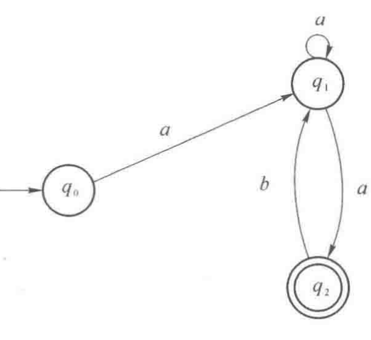
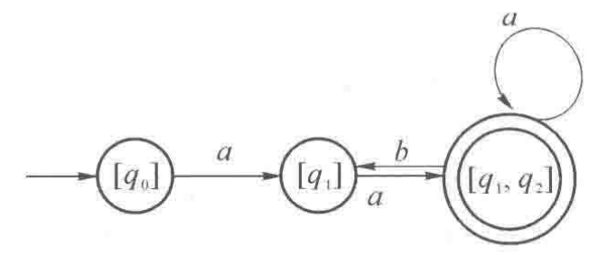
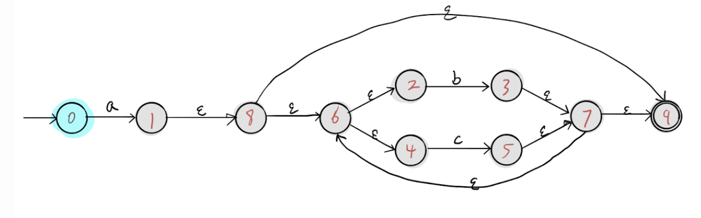
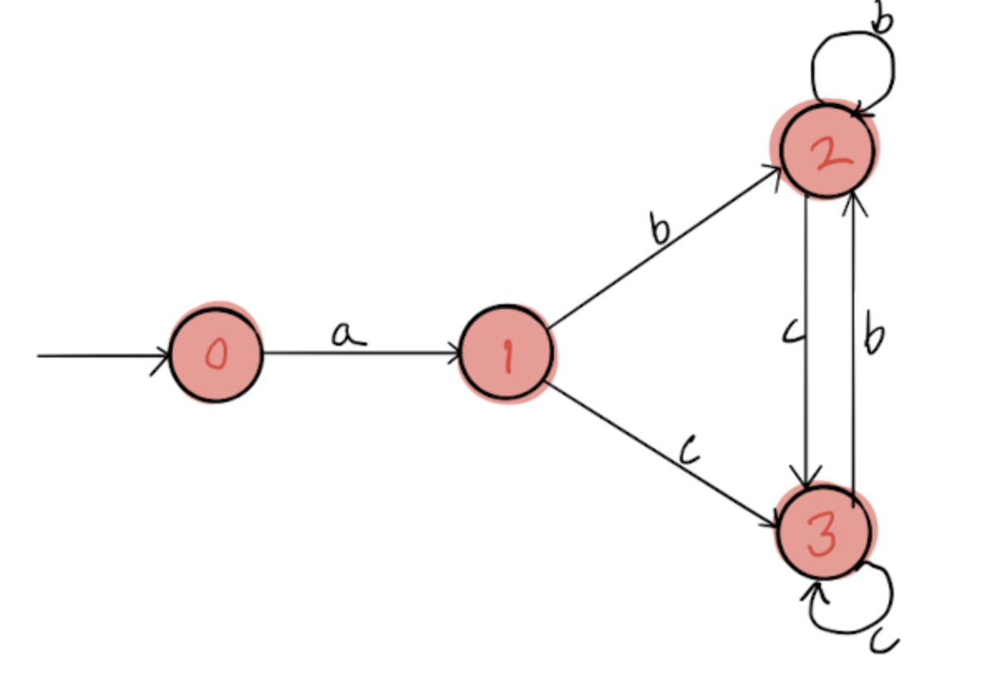

# NFA2DFA:NFA到DFA的转换器

[toc]

## 源码安装

在`src`所在的目录下，运行如下命令

```bash
mkdir build
cd build
cmake ../src
make
```

执行完以上命令后，`build`目录下将会有`NFA2DFA`可执行文件，这就是NFA转DFA的转换器。

由于源码结构简单，若没有cmake工具，可以进入src目录简单的通过如下命令得到可执行文件。

```bash
gcc -o NFA2DFA bitarray.c DFA.c NFA.c main.c convert.c
```

---

## 输入

`NFA2DFA`实现了NFA到DFA的转换功能，该程序的输入为NFA,如何来描述一个NFA呢？众所周知,NFA的形式描述如下
$$
M = (Q,T,\delta,q_0,F)
$$
即一个NFA可以看做一个五元组，只需给定状态集合、字母表、转换函数、初始状态、终止状态集即可。

### 状态集合的描述

我们的程序输入按照以下形式描述状态集合

```c
Q = {q0,q1,q2}
```

程序会自动跳过空白符，用户可以自己随意增添空白。状态的名称是字母开头、字母和数字的组合即可,状态数量不限(只要你不把内存用光)。例如下面的输入也是合法的：

```c
Q  =  {state1 ,   q2 , kk , nb }
```

### 字母表的描述

我们的程序输入按照以下形式描述字母表

```c
T = {a,b}
T = {abc, ib} 
//字母不一定真是一个字母 每一个字母起一个名字就行 如此处的abc可以看做一个字母 ib也是一个字母
```

字母只要是以字母开头、字母和数字的组合即可，字母数量不限。

### 起始状态描述

如下

```c
start = statename
```

注意此处的`statename`一定得是前面描述状态集合时出现过的状态名，否则会报错。

```c
Q = {q0,q1,q2}

T = {a,b}

start = q4 //程序会提示 error line 5:no such state name(q3)
```

### 终止状态集描述

描述规则和起始状态集一致，把`Q`替换成`F`即可。如下

```c
F = { q2 }
```

### 转换函数描述

转换函数由多条规则构成，每条规则描述如下

```c
状态名,字母名 => {状态名1,状态名2... }
```

多条规则则可以描述一个转换函数，如

```c
q0,a => {q1}
q1,a => {q1,q2}
q2,b => {q1}
```

注意状态名和字母名必须是前面描述过的名称，否则程序会有相应的错误提示(可自行尝试)。

该程序还支持输入带epsilon转换的NFA,例如下面的输入也是合法的。

```c
q0,a => {q0}
q0,epsilon => {q1}

q1,b => {q1}
q1,epsilon => {q2}

q2,c => {q2}
```


### 完整的NFA描述

完整的NFA描述由以上几部分按照顺序组成（一定要严格按照上文的顺序）。

示例：

```c
Q = {q0,q1,q2}

T = {a,b,c}

start = q0

F = { q2 }

q0,a => {q0}
q0,epsilon => {q1}

q1,b => {q1}
q1,epsilon => {q2}

q2,c => {q2}

//空格和换行可以由用户自行编排
//但是五元组的描述顺序一定要严格按照这个示例的顺序
//否则会报语法错误
```

上面描述了如下图所示的NFA。



---


## 程序使用

该程序是一个命令行程序，命令格式如下

```bash
NFA2DFA -i inputfile -o outputfile
```

其中inputfile是必须的，outputfile是可选的，若不带outputfile则默认输出到stdout。

---

## 示例

### 示例1

在`example`目录下有示例的输入文件，此处以`./example/test1.nfa`为例，该文件内容如下

```c
Q = {q0,q1,q2}

T = {a,b}

start = q0

F = { q2 }

q0,a => {q1}
q1,a => {q1,q2}
q2,b => {q1}
```

上述描述的状态机如下图



输入如下命令

```bash
./NFA2DFA -i ../example/test1.nfa
```

具体路径看用户所在的目录，用户也可以用`-o ouputfile`指定输出文件，程序输出如下

```c
Q = {Q0,Q1,Q2}

T = {a,b}

start = Q0

F = { Q2 }

Q0,a => Q1

Q1,a => Q2

Q2,b => Q1
Q2,a => Q2

----------------  //分割线前的输出为DFA的五元组，和输入类似（但不完全一致）
Q0 = [q0 ]
Q1 = [q1 ]
Q2 = [q1 q2 ]
  
//每一个DFA状态相当于NFA状态的集合
//分割线后的内容指的就是某个DFA状态对应哪些NFA状态
//如Q2 = [q1 q2]指DFA的状态Q2相当于NFA状态的集合{q1, q2}
```

该结果图如下




### 示例2

这是一个稍微复杂的示例，示例输入见`./example/test3.nfa`

```c
Q = {q0,q1,q2,q3,q4,q5,q6,q7,q8,q9}

T = {a,b,c}

start = q0

F = {q9}

q0,a => {q1}

q1,epsilon => {q8}

q8,epsilon => {q6,q9}

q6,epsilon => {q2,q4}

q2,b => {q3}

q4,c => {q5}

q3,epsilon => {q7}

q5,epsilon => {q7}

q7,epsilon => {q9,q6}

```

该输入对应的状态图如下



程序输出如下

```c
Q = {Q0,Q1,Q2,Q3}

T = {a,b,c}

start = Q0

F = { Q1 Q2 Q3 }

Q0,a => Q1

Q1,c => Q3
Q1,b => Q2

Q2,c => Q3
Q2,b => Q2

Q3,c => Q3
Q3,b => Q2

----------------
Q0 = [q0 ]
Q1 = [q1 q2 q4 q6 q8 q9 ]
Q2 = [q2 q3 q4 q6 q7 q9 ]
Q3 = [q2 q4 q5 q6 q7 q9 ]
```

对应结果的DFA如下图




